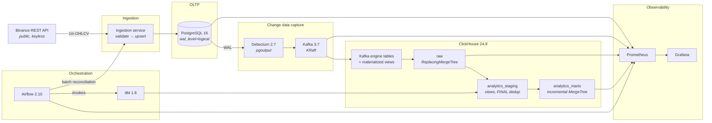

# Crypto Analytics Platform

An end-to-end analytics engineering pipeline. A public REST API is ingested into
PostgreSQL, replicated into ClickHouse in near real time by Debezium change data
capture, modelled into staging and mart layers with dbt, orchestrated by Airflow,
and monitored with Prometheus and Grafana.

The whole stack starts with one command and converges on its own.

```bash
cp .env.example .env && docker compose up -d
```

---

## Contents

- [Architecture](#architecture)
- [Quick start](#quick-start)
- [Dependencies and setup](#dependencies-and-setup)
- [Data source](#data-source)
- [Validating that data moved through each stage](#validating-that-data-moved-through-each-stage)
- [Accessing the databases, orchestrator and observability stack](#accessing-the-databases-orchestrator-and-observability-stack)
- [CI/CD](#cicd)
- [Repository layout](#repository-layout)
- [Design documentation](#design-documentation)
- [Operating the stack](#operating-the-stack)

---

## Architecture



Data moves along two paths on purpose:

- **The streaming path** is continuous. The ingester polls every 20 seconds,
  Debezium streams every committed change, and ClickHouse materialises it within
  about a second. Nothing schedules this; it just runs.
- **The orchestrated path** runs every 15 minutes. It heals whatever the
  streaming path missed, waits for CDC to actually settle, then rebuilds and
  tests the models. Both paths call the same ingestion code, so they cannot
  drift apart.

Full explanation in [docs/DESIGN.md](docs/DESIGN.md).

---

## Quick start

**Requirements:** Docker Engine 24+ with Compose v2, and roughly 8 GB of RAM
available to Docker. Nothing else — no local Python, no local database.

```bash
git clone https://github.com/iManukr/crypto-analytics-platform.git
cd crypto-analytics-platform
cp .env.example .env
docker compose up -d
```

First run pulls images and builds three of them, so allow 5–10 minutes. After
that, block until everything reports healthy:

```bash
bash scripts/wait_for_stack.sh
```

Then confirm data reached every stage:

```bash
bash scripts/validate_stage.sh all
```

If you have `make`, the same three steps are `make up`, `make wait`, `make validate`.

`.env.example` is a complete working configuration. It is committed on purpose so
a reviewer can start the stack without inventing credentials; the values in it
are local-only development defaults and are never reachable from outside the
Docker network.

### Shutting down

```bash
docker compose down      # stop, keep the data
docker compose down -v   # stop and delete every volume (full reset)
```

---

## Dependencies and setup

Everything runs in containers. The versions are pinned in
[`docker-compose.yml`](docker-compose.yml):

| Component | Version | Role |
|---|---|---|
| PostgreSQL | 16 | OLTP system of record, logical replication source |
| Debezium Connect | 2.7.3 | Captures WAL changes, publishes to Kafka |
| Apache Kafka | 3.7 (KRaft) | CDC transport. No ZooKeeper |
| ClickHouse | 24.8 | OLAP warehouse; consumes Kafka natively |
| dbt-core / dbt-clickhouse | 1.8 | Staging and mart transformations |
| Apache Airflow | 2.10.5 | Orchestration (`LocalExecutor`) |
| Prometheus | 2.55 | Metrics and alert evaluation |
| Grafana | 11.3 | Dashboards |
| Python | 3.11 | Ingestion service and metrics exporter |

**Configuration** lives entirely in `.env`. Nothing is hardcoded in a service —
credentials, symbols, poll intervals, SLA thresholds and published ports are all
read from there. `.env.example` documents every variable inline.

**Local development** (optional — only needed to run the test suite outside
Docker):

```bash
python -m venv .venv
.venv/bin/pip install -r ingestion/requirements.txt
.venv/bin/pip install pytest pytest-cov ruff pyyaml
.venv/bin/python -m pytest tests/unit -v
```

---

## Data source

**[Binance Spot REST API](https://developers.binance.com/docs/binance-spot-api-docs)** —
`GET https://api.binance.com/api/v3/klines`, 1-minute OHLCV candles.

**Authentication: none.** The klines endpoint is public and keyless. There is no
API key to obtain, no account to create, and no secret to configure. The only
constraint is a per-IP rate limit, which the ingester respects by honouring
`Retry-After` on HTTP 429.

Each candle carries open/high/low/close, volume, quote volume, trade count and
taker-buy volumes. A second, structurally different source — a free keyless FX
rate from [open.er-api.com](https://open.er-api.com) with
[fawazahmed0/currency-api](https://github.com/fawazahmed0/exchange-api) as
fallback — feeds a current-value table that is rewritten in place, which is what
exercises the CDC **update** path end to end.

### Two things worth knowing

**Binance is geo-restricted in some jurisdictions**, including most GitHub Actions
runners. The ingester walks a failover list (`api.binance.com` →
`api-gcp.binance.com` → `api.binance.us`) and, after three consecutive failures,
degrades to a deterministic offline generator so the pipeline keeps demonstrating
itself rather than showing an empty dashboard.

**That fallback is clearly labelled, never disguised.** Rows it produces are
stamped `source = 'replay'`, which flows through to `dq_synthetic_source` in
staging and `is_synthetic` in the ML mart. The `ingest_active_source` metric goes
to 1 for `replay`, a Grafana panel shows it, and a Prometheus alert fires. CI runs
in this mode deliberately (`INGEST_SOURCE=replay`) so a third-party API's
availability can never decide whether a pull request is mergeable.

---

## Validating that data moved through each stage

One command checks all four stages and reports what it found at each:

```bash
bash scripts/validate_stage.sh all
```

Or check one stage at a time — `postgres`, `kafka`, `clickhouse`, `marts`. What
each stage proves, and how to check it by hand:

### Stage 1 — the REST API reached PostgreSQL

```bash
docker compose exec postgres psql -U crypto_app -d crypto -c "
  SELECT symbol,
         count(*)                       AS candles,
         max(open_time)                 AS newest,
         now() - max(open_time)         AS behind_by
  FROM crypto.market_candles_1m
  GROUP BY symbol;"
```

Healthy when `behind_by` stays under about two minutes and `candles` grows on
repeat runs.

### Stage 2 — Debezium is publishing change events to Kafka

```bash
# The connector and its task must both be RUNNING
curl -s http://localhost:8083/connectors/crypto-oltp-cdc/status | python -m json.tool

# The CDC topics exist
docker compose exec kafka kafka-topics --bootstrap-server localhost:29092 --list | grep '^cdc'

# Read a change event
docker compose exec kafka kafka-console-consumer \
  --bootstrap-server localhost:29092 \
  --topic cdc.crypto.market_candles_1m --max-messages 1 --from-beginning
```

### Stage 3 — CDC replicated into ClickHouse

```bash
curl -s -u analytics:analytics_pw http://localhost:8123/ --data-binary "
  SELECT count()                                                   AS rows,
         max(open_time)                                            AS newest,
         round(avg((toUnixTimestamp64Milli(_cdc_arrived_at)
                    - toInt64(_source_ts_ms)) / 1000), 2)          AS avg_lag_seconds
  FROM raw.market_candles_1m
  WHERE _cdc_arrived_at >= now() - INTERVAL 15 MINUTE
  FORMAT Vertical"
```

`avg_lag_seconds` is true end-to-end CDC latency — Postgres commit to ClickHouse
visibility — measured from the rows themselves, not inferred from queue depth.
It should sit around one second.

The dead-letter table must be empty. Any row in it means a change event did not
make it into the warehouse:

```bash
curl -s -u analytics:analytics_pw http://localhost:8123/ \
  --data-binary "SELECT count() FROM raw.cdc_dead_letters"
```

### Stage 4 — dbt built the staging and mart layers

```bash
curl -s -u analytics:analytics_pw http://localhost:8123/ --data-binary "
  SELECT 'stg_market_candles' AS model, count() AS rows FROM analytics_staging.stg_market_candles
  UNION ALL SELECT 'fct_candles_1m',   count() FROM analytics_marts.fct_candles_1m
  UNION ALL SELECT 'agg_candles_5m',   count() FROM analytics_marts.agg_candles_5m
  UNION ALL SELECT 'ml_features_1m',   count() FROM analytics_marts.ml_features_1m
  UNION ALL SELECT 'dim_symbol',       count() FROM analytics_marts.dim_symbol
  UNION ALL SELECT 'fct_market_daily', count() FROM analytics_marts.fct_market_daily
  FORMAT PrettyCompact"
```

Marts appear after the first DAG run. To not wait for the schedule:

```bash
docker compose exec airflow-scheduler airflow dags trigger crypto_analytics_pipeline
```

### The check that actually proves CDC works

Everything above shows data arriving. This shows it arriving *correctly* —
make a change in Postgres and watch it appear in ClickHouse:

```bash
# Flip a value in the OLTP database
docker compose exec postgres psql -U crypto_app -d crypto -c \
  "UPDATE crypto.symbols SET display_name = 'CDC PROOF' WHERE symbol = 'ETHUSDT';"

# Within a second or two, ClickHouse has the new value - and FINAL collapses
# the old version away rather than leaving two rows
sleep 3
curl -s -u analytics:analytics_pw http://localhost:8123/ --data-binary \
  "SELECT symbol, display_name, _op, _lsn FROM raw.symbols FINAL FORMAT PrettyCompact"
```

The `cdc_reconciliation` DAG does this continuously and rigorously: it counts
both sides per symbol per day and fails if a completed day disagrees. That is the
only check that detects a *silently dropped* change event, which is the failure
mode connector-state and consumer-lag monitoring cannot see.

---

## Accessing the databases, orchestrator and observability stack

| Service | URL | Credentials |
|---|---|---|
| **Airflow** | http://localhost:8080 | `admin` / `admin` |
| **Grafana** | http://localhost:3000 | `admin` / `admin` (anonymous viewing enabled) |
| **Prometheus** | http://localhost:9090 | none |
| **ClickHouse** (HTTP + query UI) | http://localhost:8123/play | `analytics` / `analytics_pw` |
| **PostgreSQL** | `localhost:5432` | `crypto_app` / `crypto_app_pw`, database `crypto` |
| **Kafka** | `localhost:9092` | none (PLAINTEXT) |
| **Kafka Connect REST** | http://localhost:8083/connectors | none |
| **Ingestion metrics** | http://localhost:8000/metrics | none |
| **Pipeline/DQ exporter** | http://localhost:9101/metrics | none |

All ports are configurable in `.env` if any of them collide with something you
already run.

**Shell access:**

```bash
docker compose exec postgres psql -U crypto_app -d crypto
docker compose exec clickhouse clickhouse-client --user analytics --password analytics_pw
docker compose exec airflow-scheduler bash
```

### What to look at first

**Grafana → Crypto Analytics Platform → Pipeline Health.** The top row answers
"is the pipeline delivering correct, current data right now" in six tiles: CDC
connector state, CDC p95 lag, data freshness, row parity, failing dbt tests, and
which source is active. Everything below explains why not.

**Prometheus → Alerts** shows the rule set from
[`infra/prometheus/alerts.yml`](infra/prometheus/alerts.yml). Every alert links
to a section in [docs/RUNBOOK.md](docs/RUNBOOK.md).

**Airflow → DAGs** has two: `crypto_analytics_pipeline` (every 15 min:
reconcile → wait for CDC → build → test) and `cdc_reconciliation` (hourly row
parity between Postgres and ClickHouse).

---

## CI/CD

### What triggers what

| Workflow | Trigger | Purpose |
|---|---|---|
| [`ci.yml`](.github/workflows/ci.yml) | every push and PR to `main`, plus manual | Validate the change |
| [`cd.yml`](.github/workflows/cd.yml) | CI succeeding on `main`, `v*.*.*` tags, manual | Publish and deploy |

CD runs on `workflow_run` after CI reports success — not on `push`. An image can
therefore never be published from a commit whose end-to-end job failed.

### What CI validates

Jobs are ordered by how fast they fail, so a formatting mistake does not wait
behind a full stack boot:

1. **Lint** (~1 min) — `ruff check`, `ruff format --check`, and a parse of every
   YAML, JSON and XML config in the repo. Catches a malformed alert rule or
   dashboard before it becomes a container that will not start.
2. **Unit tests** (~1 min) — 128 tests over validation rules, source failover,
   rate-limit handling, gap detection and connector rendering. No containers.
3. **dbt models and data tests** (~3 min) — boots a real ClickHouse, applies the
   production `infra/clickhouse/init` SQL, seeds deterministic fixtures, then
   runs `dbt build`. Two extra assertions guard the ways a dbt run can be green
   and wrong: that no mart is vacuously empty, and that staging really did
   deduplicate the replayed CDC events in the fixture.
4. **Image builds** — all three Dockerfiles, in parallel, with layer caching.
5. **End-to-end** (~8 min) — `docker compose up` on the real stack with
   `INGEST_SOURCE=replay`, waits for convergence, runs `validate_stage.sh all`,
   triggers the Airflow DAG and waits for it to succeed, then runs the
   integration suite. This is the only job that proves CDC actually works. On
   failure it dumps container status, connector state and logs.
6. **Security** — Trivy filesystem scan for vulnerabilities, secrets and
   misconfiguration, uploaded as SARIF to the Security tab.

A single `ci-passed` job aggregates the rest, so branch protection has one thing
to require.

### What CD does

Builds and pushes the three images to GHCR tagged with the commit SHA (and a
semver tag on a release tag), attaches a build provenance attestation, scans the
published images, and deploys to the `production` environment behind a required
reviewer. When no deployment secrets are configured — a fork, a fresh clone — the
deploy job no-ops cleanly rather than failing, because a permanently red badge
teaches people to ignore the badge.

---

## Repository layout

```
.
├── docker-compose.yml          # the whole stack, one command
├── docker-compose.ci.yml       # CI overlay: offline source, faster intervals
├── .env.example                # every configuration value, documented
├── Makefile                    # make help
│
├── ingestion/                  # REST API -> PostgreSQL
│   ├── sources/                # binance (failover, rate limits) + replay
│   ├── models.py               # the validation gate
│   ├── db.py                   # idempotent upserts
│   └── service.py              # the loop, gap healing, degradation
│
├── infra/
│   ├── postgres/               # schema, roles, publication, REPLICA IDENTITY
│   ├── clickhouse/             # Kafka engines, CDC materialized views, DDL
│   ├── connect/                # Debezium connector configuration
│   ├── prometheus/             # scrape config + alert rules
│   ├── grafana/                # provisioned datasources and dashboards
│   └── statsd/                 # Airflow metric mapping
│
├── dbt/
│   ├── models/staging/         # deduplicated, typed, quality-flagged
│   ├── models/marts/           # facts, dimension, rollups, ML features
│   ├── macros/                 # incremental windows + custom generic tests
│   └── tests/                  # cross-layer reconciliation assertions
│
├── airflow/dags/               # the pipeline DAG and CDC reconciliation
├── exporter/                   # cross-system data-quality metrics
├── scripts/                    # connector registration, stage validation
├── tests/                      # unit + integration
├── docs/                       # design report, data model, observability, runbook, scaling
└── legacy/                     # the Phase-1 prototype this supersedes
```

---

## Design documentation

| Document | Covers |
|---|---|
| [DESIGN.md](docs/DESIGN.md) | Architecture diagram, data flow, technology choices and the alternatives rejected |
| [DATA_MODEL.md](docs/DATA_MODEL.md) | ERD and schema for every layer; ClickHouse engine, partitioning, ordering key and materialized view rationale |
| [OBSERVABILITY.md](docs/OBSERVABILITY.md) | What is monitored and why, tool choices, dashboards, alert philosophy |
| [SCALING.md](docs/SCALING.md) | What breaks first as volume grows, and what changes at each stage |
| [RUNBOOK.md](docs/RUNBOOK.md) | One section per alert: what it means, what to assume, what to do |

---

## Operating the stack

```bash
make help              # every available target
make up                # start everything
make wait              # block until healthy
make validate          # prove data reached all four stages
make logs SERVICE=ingestion
make trigger-dag       # run the pipeline DAG now
make dbt-build         # run every model and test
make test-unit         # fast test suite
make ci                # reproduce the CI end-to-end job locally
make clean             # stop and delete all volumes
```

### Known constraints

- **Binance geo-blocking.** Covered above: failover, then a clearly-labelled
  offline generator. Set `INGEST_SOURCE=replay` in `.env` to skip the live API
  entirely.
- **The FX leg steps daily, not tick-by-tick.** The free keyless providers
  publish once a day, so converted figures move minute-to-minute because the
  crypto price moves, while the rate itself steps once daily. Swapping in a paid
  feed is a change to `ingestion/fx.py` and nothing else.
- **`raw.candles_5m_rt` is approximate.** The real-time ClickHouse materialized
  view double-counts volume if Debezium replays after a restart. It exists for
  second-level latency; `analytics_marts.agg_candles_5m` deduplicates first and
  is the number that reconciles. This trade-off is deliberate and documented in
  [DATA_MODEL.md](docs/DATA_MODEL.md).
- **Single node throughout.** One Kafka broker, one ClickHouse node, one Postgres,
  `LocalExecutor`. Appropriate for a laptop; [SCALING.md](docs/SCALING.md) covers
  what changes when it is not.

---

## License

MIT — see [LICENSE](LICENSE).
