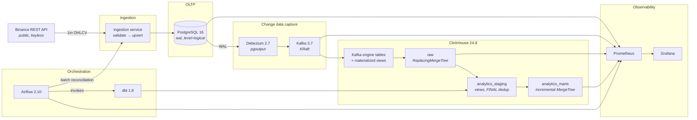

# Crypto Analytics Platform

A complete analytics engineering pipeline, start to finish. Data lands in
PostgreSQL from a public REST API, then Debezium's change data capture pushes
it into ClickHouse in near real time. From there dbt shapes it into staging
and mart layers, Airflow keeps everything on schedule, and Prometheus with
Grafana keep an eye on the whole thing.

One command brings the entire stack up, and it settles into a working state
without further intervention.

```bash
cp .env.example .env && docker compose up -d
```

---

## Contents

- [Architecture](#architecture)
- [Quick start](#quick-start)
- [Dependencies and setup](#dependencies-and-setup)
- [Data source](#data-source)
- [Validating that data moved through each stage](#validating-that-data-moved-through-each-stage)
- [Accessing the databases, orchestrator and observability stack](#accessing-the-databases-orchestrator-and-observability-stack)
- [CI/CD](#cicd)
- [Repository layout](#repository-layout)
- [Design documentation](#design-documentation)
- [Operating the stack](#operating-the-stack)

---

## Architecture



There are two deliberate paths for data to travel:

- **The streaming path** never stops. Every 20 seconds the ingester polls,
  Debezium turns each committed change into a stream, and within roughly a
  second ClickHouse has materialised it. No scheduler drives it; it simply
  keeps going.
- **The orchestrated path** fires every 15 minutes instead. It patches over
  anything the streaming path missed, gives CDC time to settle, and then
  rebuilds and re-tests the models. Since both paths run through the same
  ingestion code, they can never drift out of sync with each other.

Full explanation in [docs/DESIGN.md](docs/DESIGN.md).

---

## Quick start

**Requirements:** Docker Engine 24 or newer with Compose v2, plus about 8 GB
of RAM available to Docker. That's the whole list: no Python on your
machine, no database to install locally.

```bash
git clone https://github.com/iManukr/crypto-analytics-platform.git
cd crypto-analytics-platform
cp .env.example .env
docker compose up -d
```

The first run has to pull images and build three of them, so give it 5–10
minutes. Once that's done, wait for every service to come up healthy:

```bash
bash scripts/wait_for_stack.sh
```

Next, make sure data actually reached each stage:

```bash
bash scripts/validate_stage.sh all
```

With `make` installed, those same three steps collapse to `make up`,
`make wait`, and `make validate`.

`.env.example` isn't a placeholder: it's a working configuration checked
into the repo on purpose, so anyone reviewing the project can spin up the
stack without having to invent credentials. Everything in it is a
local-only development default, and none of it is reachable from outside
the Docker network.

### Shutting down

```bash
docker compose down      # stop, keep the data
docker compose down -v   # stop and delete every volume (full reset)
```

---

## Dependencies and setup

Everything runs in containers. The versions are pinned in
[`docker-compose.yml`](docker-compose.yml):

| Component | Version | Role |
|---|---|---|
| PostgreSQL | 16 | OLTP system of record, logical replication source |
| Debezium Connect | 2.7.3 | Captures WAL changes, publishes to Kafka |
| Apache Kafka | 3.7 (KRaft) | CDC transport. No ZooKeeper |
| ClickHouse | 24.8 | OLAP warehouse; consumes Kafka natively |
| dbt-core / dbt-clickhouse | 1.8 | Staging and mart transformations |
| Apache Airflow | 2.10.5 | Orchestration (`LocalExecutor`) |
| Prometheus | 2.55 | Metrics and alert evaluation |
| Grafana | 11.3 | Dashboards |
| Python | 3.11 | Ingestion service and metrics exporter |

**Configuration** is centralized in `.env`, full stop. No service hardcodes
anything: credentials, symbols, poll intervals, SLA thresholds, published
ports all come from that one file, and `.env.example` explains each variable
right where it's defined.

**Local development** (optional: you'd only need this to run the test suite
without Docker):

```bash
python -m venv .venv
.venv/bin/pip install -r ingestion/requirements.txt
.venv/bin/pip install pytest pytest-cov ruff pyyaml
.venv/bin/python -m pytest tests/unit -v
```

---

## Data source

**[Binance Spot REST API](https://developers.binance.com/docs/binance-spot-api-docs)**:
`GET https://api.binance.com/api/v3/klines`, 1-minute OHLCV candles.

**Authentication: none needed.** The klines endpoint is open and requires no
key: nothing to sign up for, nothing secret to configure. The one real
constraint is a per-IP rate limit, and the ingester handles that by
respecting `Retry-After` whenever it gets an HTTP 429.

Every candle includes open/high/low/close, volume, quote volume, trade
count, and taker-buy volumes. A second source, structurally quite different,
supplies FX rates: a free, keyless feed from
[open.er-api.com](https://open.er-api.com), falling back to
[fawazahmed0/currency-api](https://github.com/fawazahmed0/exchange-api).
That feed writes into a current-value table in place, which is exactly what
puts the CDC **update** path through its paces end to end.

### Two things worth knowing

**Binance blocks some jurisdictions outright**, and that includes most
GitHub Actions runners. When that happens, the ingester works through a
failover list (`api.binance.com`, then `api-gcp.binance.com`, then
`api.binance.us`) and after three straight failures falls back to a
deterministic offline generator, so the pipeline keeps showing something
rather than leaving the dashboard blank.

**That fallback never hides what it is.** Every row it generates gets
stamped `source = 'replay'`, a marker that carries through to
`dq_synthetic_source` in staging and `is_synthetic` in the ML mart. The
`ingest_active_source` metric flips to 1 for `replay`, a Grafana panel
surfaces it, and a Prometheus alert goes off. CI is set up to run this way
on purpose (`INGEST_SOURCE=replay`), specifically so that a flaky
third-party API can never decide whether a pull request is allowed to
merge.

---

## Validating that data moved through each stage

A single command walks through all four stages and reports back what it
found at each one:

```bash
bash scripts/validate_stage.sh all
```

Or step through them individually: `postgres`, `kafka`, `clickhouse`,
`marts`. Here's what each stage actually proves, and how to verify it
manually:

### Stage 1: the REST API reached PostgreSQL

```bash
docker compose exec postgres psql -U crypto_app -d crypto -c "
  select symbol,
         count(*)                       as candles,
         max(open_time)                 as newest,
         now() - max(open_time)         as behind_by
  from crypto.market_candles_1m
  group by symbol;"
```

It's healthy as long as `behind_by` sits under roughly two minutes and
`candles` keeps climbing on repeated runs.

### Stage 2: Debezium is publishing change events to Kafka

```bash
# The connector and its task must both be RUNNING
curl -s http://localhost:8083/connectors/crypto-oltp-cdc/status | python -m json.tool

# The CDC topics exist
docker compose exec kafka kafka-topics --bootstrap-server localhost:29092 --list | grep '^cdc'

# Read a change event
docker compose exec kafka kafka-console-consumer \
  --bootstrap-server localhost:29092 \
  --topic cdc.crypto.market_candles_1m --max-messages 1 --from-beginning
```

### Stage 3: CDC replicated into ClickHouse

```bash
curl -s -u analytics:analytics_pw http://localhost:8123/ --data-binary "
  select count()                                                  as rows,
         max(open_time)                                            as newest,
         round(avg((toUnixTimestamp64Milli(_cdc_arrived_at)
                    - toInt64(_source_ts_ms)) / 1000), 2)          as avg_lag_seconds
  from raw.market_candles_1m
  where _cdc_arrived_at >= now() - INTERVAL 15 MINUTE
  format Vertical"
```

`avg_lag_seconds` reflects genuine end-to-end CDC latency (the gap from a
Postgres commit to ClickHouse visibility) computed straight from the rows
themselves rather than guessed from queue depth. Expect it to hover around
one second.

The dead-letter table should have nothing in it: a single row there means
some change event never made it into the warehouse:

```bash
curl -s -u analytics:analytics_pw http://localhost:8123/ \
  --data-binary "SELECT count() FROM raw.cdc_dead_letters"
```

### Stage 4: dbt built the staging and mart layers

```bash
curl -s -u analytics:analytics_pw http://localhost:8123/ --data-binary "
  SELECT 'stg_market_candles' AS model, count() AS rows FROM analytics_staging.stg_market_candles
  UNION ALL SELECT 'fct_candles_1m',   count() FROM analytics_marts.fct_candles_1m
  UNION ALL SELECT 'agg_candles_5m',   count() FROM analytics_marts.agg_candles_5m
  UNION ALL SELECT 'ml_features_1m',   count() FROM analytics_marts.ml_features_1m
  UNION ALL SELECT 'dim_symbol',       count() FROM analytics_marts.dim_symbol
  UNION ALL SELECT 'fct_market_daily', count() FROM analytics_marts.fct_market_daily
  FORMAT PrettyCompact"
```

Marts don't show up until the first DAG run completes. To skip waiting on
the schedule:

```bash
docker compose exec airflow-scheduler airflow dags trigger crypto_analytics_pipeline
```

### The check that actually proves CDC works

Everything up to this point confirms data is arriving. This next check
confirms it's arriving *correctly*, by making a change in Postgres and
watching for it to show up in ClickHouse:

```bash
# Flip a value in the OLTP database
docker compose exec postgres psql -U crypto_app -d crypto -c \
  "UPDATE crypto.symbols SET display_name = 'CDC PROOF' WHERE symbol = 'ETHUSDT';"

# Within a second or two, ClickHouse has the new value - and FINAL collapses
# the old version away rather than leaving two rows
sleep 3
curl -s -u analytics:analytics_pw http://localhost:8123/ --data-binary \
  "SELECT symbol, display_name, _op, _lsn FROM raw.symbols FINAL FORMAT PrettyCompact"
```

The `cdc_reconciliation` DAG runs this exact check continuously, and
rigorously: it tallies both sides per symbol per day and fails the moment a
completed day doesn't match. It's the only mechanism that catches a
*silently dropped* change event, a failure mode that connector-state and
consumer-lag monitoring simply can't see.

---

## Accessing the databases, orchestrator and observability stack

| Service | URL | Credentials |
|---|---|---|
| **Airflow** | http://localhost:8080 | `admin` / `admin` |
| **Grafana** | http://localhost:3000 | `admin` / `admin` (anonymous viewing enabled) |
| **Prometheus** | http://localhost:9090 | none |
| **ClickHouse** (HTTP + query UI) | http://localhost:8123/play | `analytics` / `analytics_pw` |
| **PostgreSQL** | `localhost:5432` | `crypto_app` / `crypto_app_pw`, database `crypto` |
| **Kafka** | `localhost:9092` | none (PLAINTEXT) |
| **Kafka Connect REST** | http://localhost:8083/connectors | none |
| **Ingestion metrics** | http://localhost:8000/metrics | none |
| **Pipeline/DQ exporter** | http://localhost:9101/metrics | none |

Every port can be reconfigured in `.env`, in case one of them collides with
something already running on your machine.

**Shell access:**

```bash
docker compose exec postgres psql -U crypto_app -d crypto
docker compose exec clickhouse clickhouse-client --user analytics --password analytics_pw
docker compose exec airflow-scheduler bash
```

### What to look at first

**Grafana → Crypto Analytics Platform → Pipeline Health.** The top row
answers one question (is the pipeline delivering correct, current data
right now) across six tiles: CDC connector state, CDC p95 lag, data
freshness, row parity, failing dbt tests, and which source is active.
Everything underneath exists to explain it when the answer is no.

**Prometheus → Alerts** displays the rule set defined in
[`infra/prometheus/alerts.yml`](infra/prometheus/alerts.yml), and each alert
links straight to its section of [docs/RUNBOOK.md](docs/RUNBOOK.md).

**Airflow → DAGs** lists exactly two: `crypto_analytics_pipeline`, which
runs every 15 minutes through reconcile → wait for CDC → build → test, and
`cdc_reconciliation`, which checks row parity between Postgres and
ClickHouse every hour.

---

## CI/CD

### What triggers what

| Workflow | Trigger | Purpose |
|---|---|---|
| [`ci.yml`](.github/workflows/ci.yml) | every push and PR to `main`, plus manual | Validate the change |
| [`cd.yml`](.github/workflows/cd.yml) | CI succeeding on `main`, `v*.*.*` tags, manual | Publish and deploy |

CD is triggered by `workflow_run` once CI succeeds, not by `push` directly.
That means an image can never get published from a commit whose end-to-end
job didn't pass.

### What CI validates

Jobs run in order of how quickly they'd fail, so a simple formatting slip
doesn't have to wait behind booting the entire stack:

1. **Lint** (~1 min): runs `ruff check`, `ruff format --check`, and parses
   every YAML, JSON, and XML config in the repo, catching a broken alert
   rule or dashboard before it turns into a container that refuses to
   start.
2. **Unit tests** (~1 min): 128 tests covering validation rules, source
   failover, rate-limit handling, gap detection, and connector rendering;
   none of it needs a container.
3. **dbt models and data tests** (~3 min): spins up a real ClickHouse
   instance, applies the production `infra/clickhouse/init` SQL, loads
   deterministic fixtures, and runs `dbt build`. Two additional assertions
   catch the ways a dbt run can pass while still being wrong: checking that
   no mart ends up vacuously empty, and confirming staging actually
   deduplicated the replayed CDC events in the fixture.
4. **Image builds**: builds all three Dockerfiles in parallel, with layer
   caching.
5. **End-to-end** (~8 min): brings up the real stack with
   `docker compose up` and `INGEST_SOURCE=replay`, waits for it to
   converge, runs `validate_stage.sh all`, triggers the Airflow DAG and
   waits on its success, then runs the integration suite. It's the only job
   that actually proves CDC works, and if it fails, it dumps container
   status, connector state, and logs.
6. **Security**: a Trivy filesystem scan for vulnerabilities, secrets, and
   misconfiguration, with results uploaded as SARIF to the Security tab.

One `ci-passed` job rolls up all the others, giving branch protection a
single thing to require.

### What CD does

It builds and pushes all three images to GHCR, tagged with the commit SHA
(plus a semver tag when a release tag exists), attaches a build provenance
attestation, scans the published images, and deploys to the `production`
environment behind a required reviewer. If no deployment secrets exist
(think a fork or a fresh clone), the deploy job no-ops cleanly instead of
failing outright, since a badge that's permanently red just trains people
to stop looking at it.

---

## Repository layout

```
.
├── docker-compose.yml          # the whole stack, one command
├── docker-compose.ci.yml       # CI overlay: offline source, faster intervals
├── .env.example                # every configuration value, documented
├── Makefile                    # make help
│
├── ingestion/                  # REST API -> PostgreSQL
│   ├── sources/                # binance (failover, rate limits) + replay
│   ├── models.py               # the validation gate
│   ├── db.py                   # idempotent upserts
│   └── service.py              # the loop, gap healing, degradation
│
├── infra/
│   ├── postgres/               # schema, roles, publication, REPLICA IDENTITY
│   ├── clickhouse/             # Kafka engines, CDC materialized views, DDL
│   ├── connect/                # Debezium connector configuration
│   ├── prometheus/             # scrape config + alert rules
│   ├── grafana/                # provisioned datasources and dashboards
│   └── statsd/                 # Airflow metric mapping
│
├── dbt/
│   ├── models/staging/         # deduplicated, typed, quality-flagged
│   ├── models/marts/           # facts, dimension, rollups, ML features
│   ├── macros/                 # incremental windows + custom generic tests
│   └── tests/                  # cross-layer reconciliation assertions
│
├── airflow/dags/               # the pipeline DAG and CDC reconciliation
├── exporter/                   # cross-system data-quality metrics
├── scripts/                    # connector registration, stage validation
├── tests/                      # unit + integration
└── docs/                       # design report, data model, observability, runbook, scaling
```

The Phase-1 prototype that this project replaced now has its own home:
[`ethereum-price-pipeline`](../ethereum-price-pipeline).

---

## Design documentation

| Document | Covers |
|---|---|
| [DESIGN.md](docs/DESIGN.md) | Architecture diagram, data flow, technology choices and the alternatives rejected |
| [DATA_MODEL.md](docs/DATA_MODEL.md) | ERD and schema for every layer; ClickHouse engine, partitioning, ordering key and materialized view rationale |
| [OBSERVABILITY.md](docs/OBSERVABILITY.md) | What is monitored and why, tool choices, dashboards, alert philosophy |
| [SCALING.md](docs/SCALING.md) | What breaks first as volume grows, and what changes at each stage |
| [RUNBOOK.md](docs/RUNBOOK.md) | One section per alert: what it means, what to assume, what to do |

---

## Operating the stack

```bash
make help              # every available target
make up                # start everything
make wait              # block until healthy
make validate          # prove data reached all four stages
make logs SERVICE=ingestion
make trigger-dag       # run the pipeline DAG now
make dbt-build         # run every model and test
make test-unit         # fast test suite
make ci                # reproduce the CI end-to-end job locally
make clean             # stop and delete all volumes
```

### Known constraints

- **Binance geo-blocking.** Already covered above: failover first, then a
  clearly-labelled offline generator. Setting `INGEST_SOURCE=replay` in
  `.env` skips the live API altogether.
- **The FX leg updates daily, not tick-by-tick.** Since the free keyless
  providers only publish once a day, converted figures still shift
  minute-to-minute because the crypto price itself is moving, even though
  the underlying rate only steps once a day. Swapping in a paid feed only
  requires touching `ingestion/fx.py`, nothing else.
- **`raw.candles_5m_rt` is an approximation.** If Debezium replays after a
  restart, this real-time ClickHouse materialized view can double-count
  volume. It trades accuracy for second-level latency;
  `analytics_marts.agg_candles_5m` deduplicates first and is the figure
  that actually reconciles. This is a deliberate trade-off, documented in
  [DATA_MODEL.md](docs/DATA_MODEL.md).
- **Everything runs on a single node.** One Kafka broker, one ClickHouse
  node, one Postgres instance, and `LocalExecutor`. Fine for a laptop;
  [SCALING.md](docs/SCALING.md) explains what changes once it isn't.

---

## License

MIT: see [LICENSE](LICENSE).
