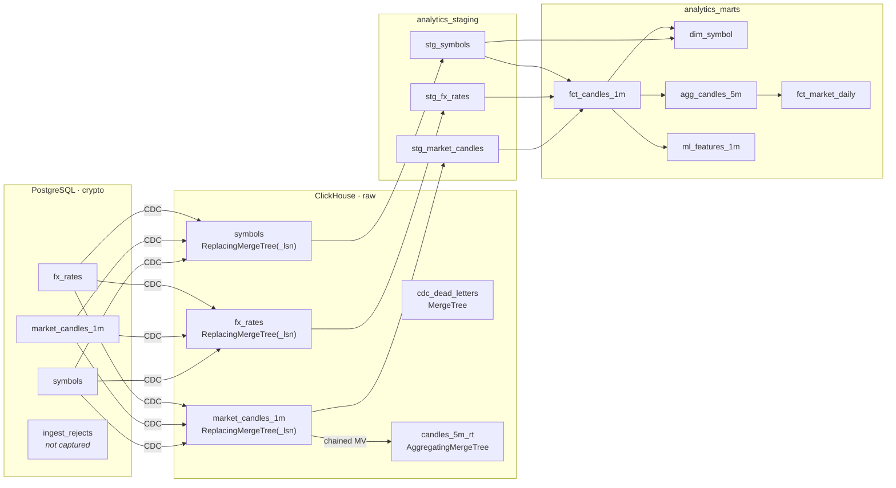

# Data Model

Schema documentation for every layer, and the reasoning behind the ClickHouse
physical design choices.

**Contents**

1. [Layer overview](#1-layer-overview)
2. [OLTP schema (PostgreSQL)](#2-oltp-schema-postgresql)
3. [CDC landing layer (ClickHouse `raw`)](#3-cdc-landing-layer-clickhouse-raw)
4. [Staging layer](#4-staging-layer)
5. [Mart layer](#5-mart-layer)
6. [ClickHouse design decisions, and why](#6-clickhouse-design-decisions-and-why)
7. [The ML dataset contract](#7-the-ml-dataset-contract)

---

## 1. Layer overview



Each layer has exactly one job:

| Layer | Job | Materialisation |
|---|---|---|
| `raw` | Land CDC events verbatim. Duplicates expected. | ReplacingMergeTree |
| `analytics_staging` | Deduplicate, type, clean, flag. Once. | Views (`FINAL`) |
| `analytics_marts` | Analytics- and ML-ready, incrementally maintained | MergeTree tables |
| `analytics_ops` | Pipeline metadata: dbt test history, run audit | MergeTree tables |

---

## 2. OLTP schema (PostgreSQL)

```mermaid
erDiagram
    SYMBOLS ||--o{ MARKET_CANDLES_1M : "has"

    SYMBOLS {
        varchar20   symbol PK
        varchar10   base_asset
        varchar10   quote_asset
        text        display_name
        boolean     is_active
        timestamptz created_at
        timestamptz updated_at
    }

    MARKET_CANDLES_1M {
        varchar20     symbol PK_FK
        timestamptz   open_time PK
        timestamptz   close_time
        numeric_20_8  open_price
        numeric_20_8  high_price
        numeric_20_8  low_price
        numeric_20_8  close_price
        numeric_30_8  volume
        numeric_30_8  quote_volume
        integer       trade_count
        numeric_30_8  taker_buy_base
        numeric_30_8  taker_buy_quote
        varchar20     source
        timestamptz   ingested_at
        timestamptz   updated_at
    }

    FX_RATES {
        varchar10     base PK
        varchar10     quote PK
        numeric_20_8  rate
        timestamptz   as_of
        text          source
        timestamptz   updated_at
    }

    INGEST_REJECTS {
        bigserial   id PK
        varchar32   source
        varchar20   symbol
        text        reason
        jsonb       payload
        timestamptz rejected_at
    }
```

Three tables are captured by CDC; `ingest_rejects` deliberately is not — it is
operational state, and replicating malformed payloads into the warehouse would
be actively unhelpful.

**The three tables have deliberately different write shapes**, because a CDC
pipeline that only ever sees INSERTs has not been tested:

| Table | Write pattern | What it exercises |
|---|---|---|
| `market_candles_1m` | Append-heavy | Throughput, partitioning, snapshot |
| `fx_rates` | **Current-value, rewritten in place** | The UPDATE path, and therefore the ReplacingMergeTree version column |
| `symbols` | Rare updates | Dimension replication, DELETE tombstones |

`fx_rates` is keyed on `(base, quote)` with no `as_of` in the key, so every
refresh is a genuine in-place UPDATE. That is what makes it the proof that
dedup-by-version actually works — with only INSERTs, a broken version column
would look perfectly fine.

`REPLICA IDENTITY FULL` on all three puts the complete old row into the WAL for
UPDATE and DELETE. The cost is WAL volume; the benefit is that a DELETE arrives
with its before-image and ClickHouse can reconstruct the row without a lookup.

---

## 3. CDC landing layer (ClickHouse `raw`)

### `raw.market_candles_1m`

```sql
ENGINE = ReplacingMergeTree(_lsn)
PARTITION BY toYYYYMM(open_time)
ORDER BY (symbol, open_time)
TTL toDateTime(open_time) + INTERVAL 24 MONTH
```

Source columns plus CDC metadata:

| Column | Meaning |
|---|---|
| `_op` | `c` create, `u` update, `d` delete, `r` snapshot read |
| `_lsn` | Postgres log sequence number — **the dedup version** |
| `_source_ts_ms` | Postgres commit time, epoch ms |
| `_kafka_partition`, `_kafka_offset` | Provenance back to the exact message |
| `_cdc_arrived_at` | `now64(3)` when ClickHouse materialised the row |

`_source_ts_ms` and `_cdc_arrived_at` together give **true end-to-end CDC
latency**, measured from the data rather than inferred from queue depth. That
distinction matters: Kafka consumer lag can read zero while the data is hours
stale, because a dead connector produces nothing to lag on.

### `raw.fx_rates` — a deliberate semantic change

```sql
ENGINE = ReplacingMergeTree(_lsn)
ORDER BY (base, quote, as_of)   -- note: as_of is IN the key
```

Postgres keeps only the current rate per pair. Including `as_of` in the ORDER BY
means ClickHouse keeps **one row per published rate**, so the warehouse
accumulates the history the OLTP store discards, while dedup still collapses
replayed events within a single `as_of`.

Without this, `fct_candles_1m` could only reprice history at today's rate — and
every historical KES figure would silently change every day. That class of bug
is very hard to notice and very hard to explain afterwards.

### `raw.candles_5m_rt` — the fast, approximate rollup

An `AggregatingMergeTree` fed by a materialized view chained off
`raw.market_candles_1m`, so a 5-minute bucket updates within about a second of
the underlying minute landing, with no orchestrator involved.

> **Read this before trusting its volume column.** Debezium is at-least-once. On
> a connector restart the same minute can be inserted twice. `argMin`/`argMax`/
> `max`/`min` states are idempotent under replay; **`sumState` is not** —
> replayed rows double-count volume and trade count.
>
> This is why the object is positioned as the *fast, approximate* serving layer
> and `analytics_marts.agg_candles_5m` — which deduplicates before aggregating —
> is authoritative. Dashboards needing the last few seconds read this one;
> anything that has to reconcile reads the mart. The Grafana panel titles say
> which is which.

`minutes_covered` (a `uniqExact` state over `open_time`) is exposed as a
completeness signal: a bucket reporting fewer than 5 distinct minutes is still
filling or has a gap.

---

## 4. Staging layer

Views, not tables. Staging cleans, types and deduplicates; it holds no state of
its own, so materialising it would add a copy of the data and a second thing
that can be stale.

| Model | Does |
|---|---|
| `stg_market_candles` | `FINAL` dedup, drop tombstones, derive `price_change_pct` / `taker_buy_ratio` / `cdc_lag_seconds`, attach six DQ flags and a rolled-up `is_valid` |
| `stg_symbols` | `FINAL` dedup; deletes **kept** and exposed as `is_deleted` |
| `stg_fx_rates` | `FINAL` dedup, drop tombstones and non-positive rates |

Deletes are treated differently on purpose: a deleted *candle* is noise and gets
filtered, but a deleted *symbol* is information — it should stop appearing in
new facts while its history stays joinable.

The `FINAL` cost is paid here exactly once so no downstream model has to
remember to. It is bounded by `do_not_merge_across_partitions_select_final = 1`
(see [§6](#6-clickhouse-design-decisions-and-why)).

---

## 5. Mart layer

### `fct_candles_1m` — the canonical fact

```sql
ENGINE = MergeTree()
ORDER BY (symbol, open_time)
PARTITION BY toYYYYMM(open_time)
incremental_strategy = 'delete+insert', unique_key = (symbol, open_time)
```

Enriched with the symbol dimension and, via **`ASOF LEFT JOIN`**, the FX rate in
effect at each candle's `open_time`:

```sql
asof left join fx as f
  on c.fx_base_key = f.base
 and c.open_time >= f.as_of
```

`ASOF JOIN` is the ClickHouse feature that makes point-in-time correctness cheap:
one pass, no correlated subquery. A plain join to "the latest rate" would
retroactively reprice all of history every time the rate moved.

### `agg_candles_5m` — the authoritative rollup

`argMin(open_price, open_time)` and `argMax(close_price, open_time)`, not
`min`/`max` of price. That distinction is the whole point of an OHLC bar: the
"open" is the price at the earliest minute, not the smallest price in the
window. Carries `minutes_covered` and `is_complete`.

### `fct_market_daily` — reporting

Built from `agg_candles_5m` rather than the 1-minute fact: one fifth of the rows
for an identical result on min/max/sum. Adds realised volatility via Parkinson's
high-low estimator and `coverage_pct` against 1440 minutes. Its incremental
lookback is **72 hours**, not 3, because a late update to any minute changes the
whole day's aggregate.

### `dim_symbol`

Full-refresh table — it holds a handful of rows, so incremental logic would be
pure risk. No `PARTITION BY`: partitions on a ten-row table are metadata
overhead and nothing else. Carries activity statistics and an `is_stale` flag
(active upstream but no candle in the last hour — a broken ingestion path, not
an inactive pair).

---

## 6. ClickHouse design decisions, and why

### `ORDER BY (symbol, open_time)` — symbol first

ClickHouse's primary index is sparse and built from the ORDER BY prefix. Every
real query filters by symbol and then by time range — a chart, a backtest, a
feature build all do. Symbol first lets the index prune to one symbol's granules
immediately, and the time predicate prunes within it. Reversed, every symbol's
data would be scanned for any time range.

### `PARTITION BY toYYYYMM(open_time)` — monthly, not daily

Partitions are a **pruning and lifecycle unit, not an index**. Daily partitions
would create a metadata part per partition per insert and push the table toward
the "too many parts" failure, where ClickHouse hard-rejects writes. At ~86,000
rows per symbol per month, monthly partitions are large enough to merge well,
still let a "last 90 days" query skip everything older, and let a retention
policy drop a whole month atomically.

### `ReplacingMergeTree` in `raw`, plain `MergeTree` in marts

Raw needs dedup because Debezium is at-least-once. Marts do not: staging already
deduplicated, so `ReplacingMergeTree` there would pay merge-time dedup cost on
data with no duplicates. Mart uniqueness is instead enforced by the
`delete+insert` incremental strategy plus a `unique_combination` dbt test —
which **fails loudly** rather than silently collapsing rows.

### `_lsn` as the version column

Postgres LSN is strictly monotonic within an instance, so a later UPDATE always
outranks the snapshot row for the same key. Snapshot records share the snapshot's
LSN; streaming records are strictly above it. A timestamp would tie under
sub-millisecond changes; a row-arrival counter would not survive a replay.

### `do_not_merge_across_partitions_select_final = 1`

`FINAL` is on the hot path for every staging view, and it is expensive. This
setting confines the merge to one partition at a time — the single biggest
performance lever available here. It is safe because the dedup key never spans a
partition boundary: the partition expression is derived from `open_time`, which
is itself part of the ORDER BY.

### Column codecs

`CODEC(Delta, ZSTD)` on timestamps, which are near-monotonic and compress far
better as deltas than with the default LZ4. `CODEC(ZSTD(3))` on price decimals,
which move slowly within a symbol. `CODEC(T64, ZSTD)` on `trade_count`. Typical
saving is 3–5× over defaults for very little CPU.

### The incremental lookback window

Every incremental mart reprocesses a trailing 3-hour window rather than only
strictly-new rows. This is required for correctness, not laziness:

- Debezium replays after a restart, so a loaded row may arrive again corrected.
- An upstream UPDATE changes a row whose `open_time` is in the past; a
  `where open_time > max(open_time)` filter would never see it.
- Gap healing lands old timestamps at a new wall-clock time.

`ml_features_1m` additionally **reads** from a 6-hour window while **emitting**
only the 3-hour one, so its 60-minute moving averages are fully warmed up at the
left edge of every batch. Without that, the first rows of each incremental run
would be computed from a partial window and be quietly, plausibly wrong.

---

## 7. The ML dataset contract

`analytics_marts.ml_features_1m` is a leakage-safe feature matrix. The contract
is enforced by tests, not just documented.

**Leakage policy.** Every feature column is computed over
`ROWS BETWEEN n PRECEDING AND CURRENT ROW`. The frame is written out explicitly
on every window rather than relying on the default, because ClickHouse's default
frame for an ordered window silently includes peer rows with an equal ORDER BY
value.

Exactly three columns look forward, all prefixed `target_`. Selecting
`* EXCEPT target_*` gives a leakage-free feature matrix.

**Feature groups**

| Group | Columns |
|---|---|
| Returns | `log_return_1m`, `cum_return_15`, `cum_return_60` |
| Trend | `sma_5/15/60`, `close_to_sma15`, `close_to_sma60`, `sma_ratio_5_60` |
| Volatility | `volatility_15`, `volatility_60`, `atr_15`, `atr_15_pct` |
| Momentum | `rsi_14` (Wilder's) |
| Volume | `volume_sma_60`, `volume_zscore_60`, `taker_buy_ratio`, `taker_buy_ratio_15` |
| Position | `pct_of_60m_range` |
| Time | `minute_of_day_sin/cos`, `day_of_week_sin/cos` |

Time is encoded cyclically because a raw minute-of-day integer would tell a
model that 23:59 and 00:00 are maximally distant.

**Before training, filter on:**

| Flag | Why |
|---|---|
| `is_label_resolved = 1` | The most recent minute has no "next minute" yet; its labels are placeholder zeros. Training on those teaches the model from a fabricated label. |
| `has_contiguous_history = 1` | A return computed across an ingestion gap is not a 1-minute return — it is an artefact of our uptime. |
| `is_synthetic = 0` | Excludes rows from the offline replay generator. |

Two tests enforce this. The singular test
`assert_unresolved_labels_are_neutral` fails if any unresolved row carries a
non-zero label. The integration test recomputes `sma_5` from raw closes and
compares — a frame that included the next row would produce a different number,
so this proves the window really is backward-looking.

**What this is not.** A leakage-safe dataset is not a trading signal.
Short-horizon crypto price prediction is not a solved problem, and an honest
expectation is that a model trained here demonstrates very little edge over a
majority-class baseline once fees and slippage are accounted for. The value is
the dataset and its guarantees.
