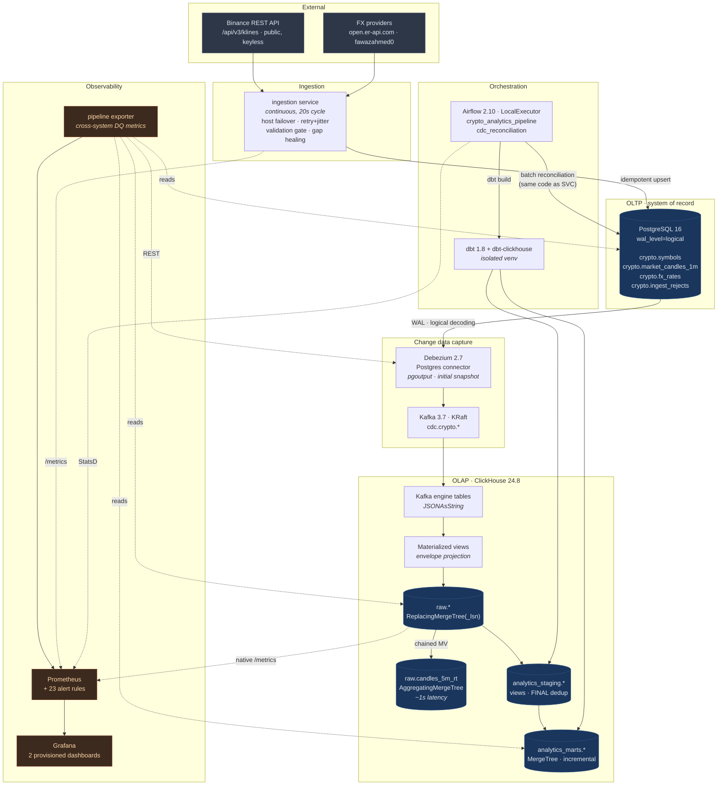

# Design Report

An end-to-end analytics engineering pipeline: a public REST API is ingested into
PostgreSQL, replicated into ClickHouse in near real time by Debezium CDC,
modelled into staging and mart layers with dbt, orchestrated by Airflow, and
monitored with Prometheus and Grafana. The whole thing starts with one command.

**Contents**

1. [Architecture](#1-architecture)
2. [Data flow](#2-data-flow)
3. [Technology choices and the alternatives rejected](#3-technology-choices-and-the-alternatives-rejected)
4. [Reliability model](#4-reliability-model)
5. [Data quality strategy](#5-data-quality-strategy)
6. [Known limitations](#6-known-limitations)

Companion documents: [DATA_MODEL.md](DATA_MODEL.md) (schemas, ERD, ClickHouse
physical design), [OBSERVABILITY.md](OBSERVABILITY.md) (what is monitored and
why), [SCALING.md](SCALING.md) (growth plan), [RUNBOOK.md](RUNBOOK.md)
(incident procedures).

---

## 1. Architecture

### The two paths, and why there are two

The single most important structural decision here is that data reaches the
warehouse by **two independent routes**, and they are not redundant — they solve
different problems.

| | Streaming path | Orchestrated path |
|---|---|---|
| **Driver** | `ingestion` container, every 20s | Airflow DAG, every 15 min |
| **Latency** | ~1–2s from Postgres commit to ClickHouse | Minutes |
| **Job** | Keep the raw layer current | Heal gaps, rebuild models, run tests |
| **Failure mode** | Data goes stale | Models go stale, raw layer keeps flowing |

A pipeline built only on the orchestrator has a floor on freshness equal to its
schedule interval. A pipeline built only on streaming has nowhere to run
transformations, tests, or backfills. Both paths call the *same*
`run_backfill()` function, so "work out what is missing and fetch it" has one
implementation and cannot drift between them.

Critically, a failure in the orchestrated path does **not** stop the streaming
path. Debezium keeps replicating and the raw layer keeps receiving data while
Airflow is down; only the marts go stale, and the freshness-by-layer panel in
Grafana shows exactly that shape, which is how an operator tells the two apart
in seconds.

---

## 2. Data flow

### Stage 1 — External API into PostgreSQL

The ingestion service polls Binance's `/api/v3/klines` endpoint for closed
1-minute OHLCV bars. Three behaviours make this more than a poll loop:

- **The window comes from the database, not from memory.** Each cycle asks
  Postgres for `max(open_time)` per symbol and fetches from there. An outage of
  any length is healed by restarting: there is no cursor file to corrupt and no
  offset to reset.
- **Only closed bars are ingested.** A bar for minute *m* is complete only once
  *m+1* has begun. Ingesting the in-flight minute produces a row whose volume
  changes after it has been written — a silent correctness bug that surfaces
  weeks later as an unreproducible number.
- **Validation is a gate, not a report.** Every row passes fifteen invariant
  checks before it can be written (`ingestion/models.py`). Failures go to
  `crypto.ingest_rejects` with the payload and the reason attached. Bad data
  never enters the pipeline, so it never has to be found and removed later.

Writes are idempotent upserts on `(symbol, open_time)`. The `ON CONFLICT` clause
carries a `WHERE ... IS DISTINCT FROM` guard, so an unchanged re-send produces
**no WAL record at all** — which means no CDC event, which means a 180-minute
backfill replay does not flood Kafka with no-op updates. This is the cheapest
optimisation in the pipeline and it lives in one clause.

### Stage 2 — PostgreSQL into Kafka via Debezium

Postgres runs with `wal_level=logical`. A publication (`dbz_publication`) is
created by the database init script rather than autocreated by the connector,
so the captured-table list is under version control and the connector's role
needs no DDL rights. All three captured tables are `REPLICA IDENTITY FULL`, so
UPDATE and DELETE events carry a complete before-image.

Two connector settings carry most of the operational weight:

**`heartbeat.interval.ms = 10000`.** A replication slot's confirmed LSN only
advances when a *captured* table changes. If the captured tables go quiet while
the rest of the database stays busy, Postgres retains WAL indefinitely and
eventually fills its disk — a monitoring component taking down the system it was
only meant to observe. The heartbeat forces periodic acknowledgement. This is
the single most common way a Debezium deployment causes an outage.

**`errors.tolerance = none`.** For most connectors, tolerating errors is
reasonable degradation. For CDC it is not: silently skipping a change event does
not degrade the data, it *corrupts the replica* — permanently and invisibly,
because the missed change never comes back. Failing the task is correct. The
`DebeziumTaskFailed` alert fires within 30 seconds and the stream resumes from
the slot once the cause is fixed.

### Stage 3 — Kafka into ClickHouse

ClickHouse consumes directly with its **Kafka table engine**; there is no sink
connector. Each Kafka table reads messages as a single `String` column
(`JSONAsString`), and a materialized view projects fields out of the Debezium
envelope into a `ReplacingMergeTree` landing table.

Reading the raw envelope rather than a flattened record is deliberate:

- A new or renamed field upstream cannot break the consumer.
- No dependency on Debezium's `ExtractNewRecordState` SMT, whose option names
  changed across 1.x and 2.x.
- Before-images stay available, so a DELETE can be reconstructed without a
  lookup.

`kafka_handle_error_mode = 'stream'` routes unparseable messages to
`raw.cdc_dead_letters` instead of stalling the consumer. Any row there is a
defect and Prometheus alerts on a non-zero count.

### Stage 4 — Raw into staging and marts

dbt builds two layers. Staging models are **views** that pay the `FINAL` dedup
cost exactly once, drop tombstones, cast types and attach data-quality flags.
Marts are **incremental tables** with an explicit physical design — see
[DATA_MODEL.md](DATA_MODEL.md) for engine, partitioning and ordering rationale.

The Airflow DAG will not transform on top of a dead CDC pipeline: a preflight
task asserts the connector is RUNNING, and a sensor waits for CDC to settle
before dbt runs. Without those, the models would succeed, the tests would pass
on stale data, and the dashboards would keep drawing a flat line that looks like
a quiet market rather than an outage.

---

## 3. Technology choices and the alternatives rejected

### ClickHouse Kafka engine, not the Kafka Connect ClickHouse sink

The sink connector is the more conventional choice. The engine wins here on
three counts: one fewer process to size, monitor and restart; offsets committed
by ClickHouse itself, so "what has ClickHouse consumed" has exactly one answer
(visible in `system.kafka_consumers`); and back-pressure handled inside
ClickHouse's own insert path.

**What we give up:** the sink connector offers richer transformation, exactly-once
semantics via its own state store, and Schema-Registry integration. At this
scale none of those pay for a second process. At the volume described in
[SCALING.md](SCALING.md), the calculus changes.

### Airflow, not Dagster

Airflow costs three extra containers and a metadata database; Dagster would cost
two and offer asset-level lineage that maps neatly onto staging→mart. Airflow
was chosen for operational familiarity — it is what most teams inheriting this
will already run — and because the sensor/trigger-rule semantics used here
(`mode="reschedule"`, `ALL_DONE` on the publisher) are well-worn.

**What we give up:** asset-based lineage and built-in freshness policies, both of
which would have replaced some hand-written code in `pipeline_common.py`.

### dbt in an isolated virtualenv inside the Airflow image

dbt-core and Airflow have overlapping, conflicting constraints on Jinja2, click
and protobuf. Installing dbt into `/opt/dbt-venv` and invoking it as a
subprocess means an Airflow upgrade cannot break dbt and a dbt upgrade cannot
break the scheduler. The alternative — a separate dbt container driven by
`DockerOperator` — needs the Docker socket mounted into Airflow, which is a
meaningful privilege escalation for no benefit here.

### Schemaless JSON, not Avro plus Schema Registry

A Schema Registry would add a service, a failure mode and a bootstrap ordering
constraint. Because the ClickHouse side reads the envelope as a string and
projects fields explicitly, it buys nothing at this scale. Moving to Avro is a
converter swap plus a format change on three Kafka tables — deliberately kept a
small change rather than a rewrite.

### JSON over Kafka costs ~3× the bytes of Avro

Accepted at this volume (a few thousand messages per minute). Not accepted at
the volume in [SCALING.md](SCALING.md), which is where the migration is planned.

---

## 4. Reliability model

**Delivery semantics.** The pipeline is **at-least-once end to end, converging on
exactly-once semantics at rest.** Debezium can replay after a restart; Kafka can
redeliver; ClickHouse's Kafka engine commits offsets asynchronously. Every one of
those produces duplicates, and every layer is built to absorb them:

| Layer | Duplicate handling |
|---|---|
| Postgres | Upsert on the natural key |
| ClickHouse raw | `ReplacingMergeTree(_lsn)` — highest LSN wins |
| Staging | `FINAL` forces dedup at read time |
| Marts | `delete+insert` on the unique key |

The one place this is *not* fully true is `raw.candles_5m_rt`, the real-time
materialized view. Its `sumState(volume)` is not idempotent under replay. That
is documented in the DDL, in [DATA_MODEL.md](DATA_MODEL.md), and in the Grafana
panel titles, and it is why `analytics_marts.agg_candles_5m` exists as the
authoritative rollup. Presenting an approximate number as exact would be the
worse failure.

**Recovery.** Every component recovers by restarting:

- *Ingestion* re-derives its window from the database.
- *Debezium* resumes from the replication slot's confirmed LSN.
- *ClickHouse* resumes from its committed consumer-group offsets.
- *dbt* reprocesses a 3-hour trailing window, so anything that arrived late is
  picked up.

**The bounded failure.** `max_slot_wal_keep_size=2GB` caps WAL retention. If
Debezium stays down long enough to exceed it, Postgres invalidates the slot: CDC
breaks loudly and needs a re-snapshot. That is a deliberate trade — a noisy,
recoverable failure in the *pipeline* is strictly better than a disk-full outage
in the *source database*.

---

## 5. Data quality strategy

Quality is enforced at four points, deliberately, because each catches a class
the others cannot:

**1. Ingest-time validation** (`ingestion/models.py`) — the only place a bad row
can still be stopped cheaply. Fifteen invariants: prices positive, OHLC
internally consistent, taker volume ≤ total volume, timestamps minute-aligned
and not in the future. Rejects are quarantined with their payload.

**2. CDC integrity** — the dead-letter table catches messages that could not be
parsed; row-count parity between Postgres and ClickHouse catches change events
that were silently lost. Nothing else can detect the second one.

**3. dbt tests** (74 across the project) — schema tests plus seven custom generic
tests (`value_between`, `unique_combination`, `no_future_timestamps`,
`ohlc_consistent`, `not_empty`, `fresher_than`, `series_coverage`) and four
singular tests that assert cross-layer reconciliation. All run at
`severity: error` with `store_failures: true`, so a failure stops the DAG and
the offending rows are persisted for inspection.

Two of those deserve specific mention. `not_empty` exists because **every other
test passes trivially on zero rows** — a model that builds successfully and is
empty is a silent failure. `no_future_timestamps` exists because a single
future-dated row pins the freshness metric at zero, so the staleness alert can
never fire again: the monitoring fails silently and permanently.

**4. Continuous monitoring** — the pipeline exporter measures freshness, CDC lag
and row parity every 15 seconds. dbt tests run on a schedule; these run always.

Custom generic tests are hand-written rather than pulled from `dbt_utils`
because `dbt deps` needs network access at run time, and an orchestrated
pipeline that cannot start because a package registry is briefly unavailable is
a self-inflicted outage.

---

## 6. Known limitations

Stated plainly, because a design document that lists only strengths is not a
design document.

- **Single-node everything.** One Kafka broker, one ClickHouse node, one Postgres
  instance, `LocalExecutor`. No replication anywhere. Appropriate for a
  demonstrable stack; [SCALING.md](SCALING.md) covers what changes when it is
  not.
- **The FX leg steps daily.** Both free providers publish roughly once per day,
  so the KES figures move minute-to-minute only because *ETH* moves. Swapping in
  a paid tick feed is a change to `ingestion/fx.py` and nothing else.
- **`REPLICA IDENTITY FULL` costs WAL volume.** It logs the entire old row on
  every UPDATE and DELETE. Acceptable at this volume, and the reason the
  before-image is available at all; revisited in [SCALING.md](SCALING.md).
- **The real-time 5-minute rollup over-counts volume under replay.** Covered
  above; the authoritative mart exists for exactly this reason.
- **`ml_features_1m` provides a leakage-safe feature matrix, not a model.** It is
  explicitly not a trading signal. Short-horizon crypto price prediction is not
  a solved problem, and the honest framing is that this is a well-built dataset
  on which a model would most likely demonstrate very little edge.
- **The offline replay source is synthetic.** It exists so CI is hermetic and so
  a reviewer behind a geo-block still sees the pipeline work. Every row it
  produces is stamped `source = 'replay'` and flagged through to the marts as
  `is_synthetic`, and the `IngestionUsingReplaySource` alert makes the
  degradation loud. It is never presented as market data.
